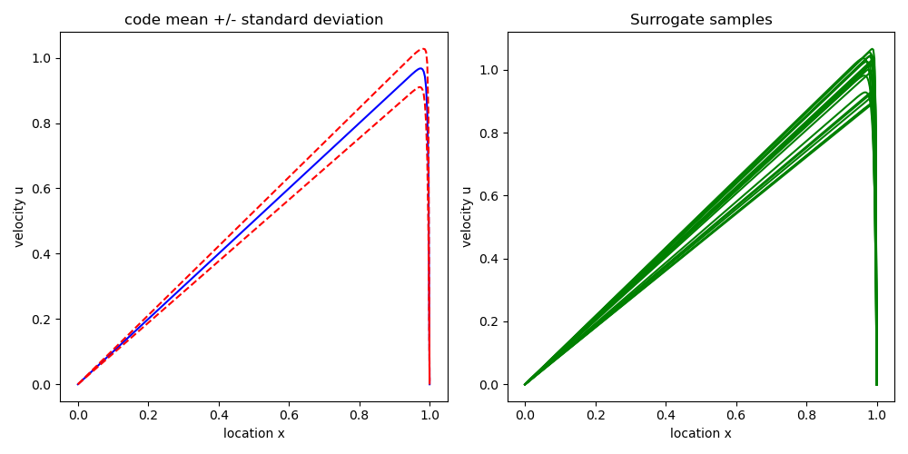
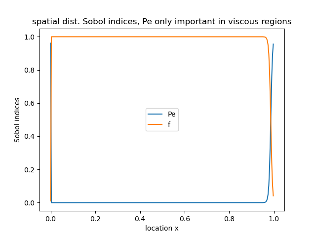

# FabUQCampaign
This tutorial execute Advection Diffusion Equation (ADE) samples from a [EasyVVUQ](https://github.com/UCL-CCS/EasyVVUQ) campaign using [FabSim3](https://github.com/djgroen/FabSim3). Jobs can be executed locally or be sent to an HPC resource:


## Installation
To install all dependencies, first follow the instructions in https://github.com/wedeling/FabUQCampaign/blob/master/Tutorial_Setup.md

## Explanation of files

+ The `FabUQCampaign` directory contains all files listed below. This directory is located at `<fab_home>/plugins/FabUQCampaign`, where `<fab_home>` is your FabSim3 home directory.

+ `FabUQCampaign/examples/advection_diffusion/*`: an example script, applying EasyVVUQ to a 1D advection diffusion equation. See the Detailed Example section below. The `example.py` file contains the full script, i.e. job executing and post processing combined. Alternatively, separate job executing and post processing script are available (`example_job_exec_only.py` and `example_post_proc_only.py`).

+ `FabUQCampaign/templates/ade`: contains the command-line instruction to run the advection diffusion equation Python script.

+ `FabUQCampaign/config_files/ade`: in this example this directory only contains the input configuration file for the ADE solver (`ade_config`, described below). In more complex models, this directory contains any (configuration) file that you need to run your model. The contents of this directory will get copied to each ensemble run directory. FabSim will automatically create the `SWEEP` directory here as well, which is the directory containing these various run directories.

## Detailed Example

### Inputs
+ As noted, the template `FabUQCampaign/template/ade` contains the command line instruction to run a single sample, in this case: `python3 $ade_exec ade_in.json`. Here, `ade_in.json` is just the input file with the parameter values generated by EasyVVUQ. Furthermore, `$ade_exec` is the full path to the Python script which runs the advection diffusion equation at the parameters of `ade_in.json`. It must be specified in `fabsim/deploy/machines_user.yml`, which in this case looks like
 
`localhost:`

 &nbsp;&nbsp;&nbsp;&nbsp;`ade_exec: "<fab_home>/plugins/FabUQCampaign/examples/advection_diffusion/sc/ade_model.py"`

Here, `<fab_home>` is your FabSim3 home directory.

### Executing an ensemble job on localhost
The advection-diffusion equation is given by:

,

where the Peclet Number (Pe) and constant external forcing term (f) are the uncertain Stochastic Collocation (SC) parameters, and u is the velocity subject to Dirichlet boundary conditions u(0)=u(1)=0. The script executes the ensemble using FabSim, computes the first two moments of the output, generates some random sample of the SC surrogate and computes the Sobol indices of Pe and f.

**Note**: Instead of a standard SC campaign, a dimension-adaptive SC example is also available, see `FabUQCampaign/examples/dimension_adaptive_example`. This samples a simple analytic function with 15 input parameters. As the main point here is to demonstate the use of FabSim3 inside an EasyVVUQ Python script, we'll continue with our 2D advection diffusion model.

The file `examples/advection_diffusion/sc/ade_model.py` contains the finite-element solver which receives the values of Pe and f.  Most steps are exactly the same as for an EasyVVUQ campaign that does not use FabSim to execute the runs. Here we'll outline the main steps. Again, the full script can be found in the `FabUQCampaign/examples/advection_diffusion` directory.

We first define a couple of (constant) flags:

```python
# home directory
HOME = os.path.abspath(os.path.dirname(__file__))
# Work directory, where the easyVVUQ directory will be placed
WORK_DIR = '/tmp'
# FabSim3 config name
CONFIG = 'ade'
# Simulation identifier
ID = '_test'
# EasyVVUQ campaign name
CAMPAIGN_NAME = CONFIG + ID
# name and relative location of the output file name
TARGET_FILENAME = './output.csv'
# location of the EasyVVUQ database
DB_LOCATION = "sqlite:///" + WORK_DIR + "/campaign%s.db" % ID
# Use QCG PilotJob or not
PILOT_JOB = False
# machine to run ensemble on
MACHINE = "localhost"
```

Most of these are self explanatory. Here, `CONFIG` is the name of the script that gets executed for each sample, in this case `ade`, which is located in `FabUQCampaign/templates/ade`, see "Explanation of files" above. `TARGET_FILENAME` is the name of the output file generated by the advection diffusion solver, and `DB_LOCATION` if the full path to the EasyVVUQ database, where all information about the Campaign is stored. Furthermore, the flag `PILOT_JOB` regulates the use of the QCG PilotJob mechanism. If `True`, FabSim will submit the ensemble to the (remote) host as a QCG PilotJob, which essentially means that all invididual jobs of the ensemble will get packaged into a single job allocation, thereby circumventing the limit on the maximum number of simultaneous jobs that is present on many supercomputers. For more info on the QCG PilotJob click [here](https://github.com/vecma-project/QCG-PilotJob). In this example we'll run the samples on the localhost (see `MACHINE`), and hence we set `PILOT_JOB=False`.

Next we define the parameter space of the advection diffusion equation, which consists of the uncertain parameters Pe and f, plus the name of the output file of `ade_model.py`:
 
```python
params = {
    "Pe": {
        "type": "real",
        "min": "1.0",
        "max": "2000.0",
        "default": "100.0"},
    "f": {
        "type": "real",
        "min": "0.0",
        "max": "10.0",
        "default": "1.0"},
    "out_file": {
        "type": "str",
        "default": "output.csv"}}
```
The `params` dict corresponds to the EasyVVUQ input config file `config_files/ade/ade_config`, which defines the input of a single model run. The content of this file is as follows:
```
{"outfile": "$out_file", "Pe": "$Pe", "f": "$f"}
```
More complex models will have more elaborate input files, but the concept remains the same. Replace the hardcoded value with a flag `$param`, and EasyVVUQ will replace the flag with a value drawn from the input distribution. To select which parameters of `params` are assigned a [Chaospy](https://chaospy.readthedocs.io/en/master/) input distribution, add these parameters to the `vary` dict, e.g.:

```python
vary = {
    "Pe": cp.Uniform(100.0, 200.0),
    "f": cp.Normal(1.0, 0.1)
}
```
Here we assigned a distribtuion to both inputs. If we had assigned a distribution to only `Pe` for example, the `$f` flag in the input file will be replaced by the `default` value defined in the `params` dict.

We now create an `actions` object that will create the run directories for each individual sample, and which will populate the input files with values using the `GenericEncoder`. An EasyVVUQ Campaign is then created, which is the overarching object that will link the database, sampler and analysis objects, see the EasyVVUQ tutorials for [more information](https://github.com/UCL-CCS/EasyVVUQ).

```python

encoder = uq.encoders.GenericEncoder(
    #the input file template is located in the FaubUQCampaign config_files folder
    template_fname= HOME + '/../../config_files/ade/ade_config',
    delimiter='$',
    target_filename='ade_in.json')

actions = uq.actions.Actions(
    uq.actions.CreateRunDirectory(root=WORK_DIR, flatten=True),
    uq.actions.Encode(encoder),
)

campaign = uq.Campaign(
    name=CAMPAIGN_NAME,
    db_location=DB_LOCATION,
    work_dir=WORK_DIR
)

campaign.add_app(
    name=CAMPAIGN_NAME,
    params=params,
    actions=actions
)
```
 
 Now we have to select a sampler, in this case we use the Stochastic Collocation (SC) sampler:
 
 ```python
sampler = uq.sampling.SCSampler(vary=vary, polynomial_order=4)

# Associate the sampler with the campaign
campaign.set_sampler(sampler)
 ```

If left unspecified, the polynomial order of the SC expansion will be set to 4. If instead we wish te use a Polynomial Chaos Expansion (PCE) sampler, simply replace `SCSampler` with `PCESampler`.

To actually execute the `actions`, run

```python 
campaign.execute().collate()
```

#### FabSim3-Python interface

We will use FabSim3 to execute the ensemble. FabSim3 is a commandline tool, but also has a Python interface that is simply a shell over the commandline tools. To import it use

```python
############################################
# Import the FabSim3 commandline interface #
############################################
import fabsim3_cmd_api as fab
```

To run the ensemble use
 
 ```python
###############################################
# run the UQ ensemble using FabSim3 interface #
###############################################

fab.run_uq_ensemble(CONFIG, campaign.campaign_dir, script='ade',
                    machine=MACHINE, PJ=PILOT_JOB)

# wait for job to complete
fab.wait(machine=MACHINE)

# check if all output files are retrieved from the remote machine, returns a Boolean flag
all_good = fab.verify(CONFIG, campaign.campaign_dir,
                      TARGET_FILENAME,
                      machine=MACHINE)

if all_good:
    # copy the results from the FabSim results dir to the EasyVVUQ results dir
    fab.get_uq_samples(CONFIG, campaign.campaign_dir, sampler.n_samples, machine=MACHINE)
else:
    print("Not all samples executed correctly")
    import sys
    sys.exit()

```
Briely:

* `fab.run_uq_ensemble`: this command submits the ensemble to the (remote) host for execution. Under the hood it uses the FabSim3 `campaign2ensemble` subroutine to copy the run directories from `WORK_DIR` to the FabSim3 `SWEEP` directory, located in `config_files/ade/SWEEP`. From there the ensemble will be sent to the (remote) host.
* `fab.wait`: this will check every minute on the status of the jobs on the remote host, and sleep otherwise, halting further execution of the script. On the localhost this command doesn't do anything.
* `fab.verify`: this will execute the `verify_last_ensemble` subroutine to see if the output file `target_filename` for each run in the `SWEEP` directory is present in the corresponding FabSim3 results directory. Returns a boolean flag. `fab.verify` will also call the FabSim `fetch_results` method, which actually retreives the results from the (remote) host. So, if you want to just get the results without verifying the presence of output files, call `fab.fetch_results(machine=MACHINE)` instead. However, if something went wrong on the (remote) host, this will cause an error later on since not all required output files will be transfered on the EasyVVUQ `WORK_DIR`.
* `fab.get_uq_samples`: copies the samples from the (local) FabSim results directory to the (local) EasyVVUQ campaign directory. It will not delete the results from the FabSim results directory. If you want to save space, you can delete the results on the FabSim side (see `results` directory in your FabSim home directory). You can also call `fab.clear_results(machine, name_results_dir)` to remove a specific FabSim results directory on a given machine.

#### Error handling

If `all_good == False` something went wrong on the (remote) host, and `sys.exit()` is called in our example, giving you the opportunity of investigating what went wrong. It can happen that a (small) number of jobs did not get executed on the remote host for some reason, whereas (most) jobs did execute succesfully. In this case simply resubmitting the failed jobs could be an option:

```python
fab.remove_succesful_runs(CONFIG, campaign.campaign_dir)
fab.resubmit_previous_ensemble(CONFIG, 'ade')
```

The first command removes all succesful run directories from the `SWEEP` dir for which the output file `TARGET_FILENAME` has been found. For this to work, `fab.verify` must have been called. Then, `fab.resubmit_previous_ensemble` simply resubmits the runs that are present in the `SWEEP` directory, which by now only contains the failed runs. After the jobs have finished, call `fab.verify` again to see if now `TARGET_FILENAME` is present in the results directory, for every run in the `SWEEP` dir.

#### Decoding

Once we are sure we have all required output files, the role of FabSim is over, and we proceed with decoding the output files using EasyVVUQ. In this case the output file is just a simple CSV file that contains the 1D `u` velocity profile:

```python
#############################################
# All output files are present, decode them #
#############################################

output_columns = ["u"]
decoder = uq.decoders.SimpleCSV(
    target_filename=TARGET_FILENAME,
    output_columns=output_columns)

actions = uq.actions.Actions(
    uq.actions.Decode(decoder)
)
campaign.replace_actions(CAMPAIGN_NAME, actions)

###########################
# Execute decoding action #
###########################

campaign.execute().collate()

# get EasyVVUQ data frame
data_frame = campaign.get_collation_result()
```

The end result is a `data_frame` which we can use for post processing.

#### Post processing

```python
############################
# Post-processing analysis #
############################

analysis = uq.analysis.SCAnalysis(sampler=sampler, qoi_cols=["u"])
results = analysis.analyse(data_frame=data_frame)
```

The `results` dict contains the statistical moments and Sobol sensitivity indices. You can also use the SC expansion as a cheap surrogate model for the original code. Some results are shown below, and we refer to the script in `examples/advection_diffusion/` to see how these can be obtained. Note that the Sobol sensitivity indices have a spatial component as well, and that the Pectlet number `Pe` is only important in the boundary layer near `x=1`.




### Executing an ensemble job on a remote host

To run the example script on a remote host, a number of changes must be made. Ensure the remote host is defined in `machines.yml` in your FabSim3 home directory, as well as the user login information and `$ade_exec` in `fabsim/deploy/machines_user.yml`. Assuming we'll run the ensemble on the Eagle super computer at the Poznan Supercomputing and Networking Center , the entry in `machines_user.yml` could look similar to the following:
```
eagle_vecma:
  username: "<your_username>"
  home_path_template: "/tmp/lustre/<your_username>"
  budget: "plgvecma2021"
  ade_exec: "/home/plgrid/<your_username>/ade_model.py"
  cores: 1
  # job wall time for each job, format Days-Hours:Minutes:Seconds
  job_wall_time : "0-0:59:00" # job wall time for each single job without PJ
  PJ_size : "1" # number of requested nodes for PJ
  PJ_wall_time : "0-00:59:00" # job wall time for PJ
  modules:
    loaded: ["python/3.7.3"] 
    unloaded: [] 
```
 Here:
 
 * `home_path_template`: the remote root directory for FabSim3, such that for instance the results on the remote machine will be stored in `home_path_template/FabSim3/results`.
 * `budget`: the name of the computational budget that you are allowed to use.
 * `ade_exec`: the equivalent to `ade_exec` defined above, in this case just the advection-diffusion Python solver on the remote host.
 * `cores`: the number of cores to use *per run*. Our simple advection diffusion solver justs need a single core, but applications which already have some built-in paralellism will require more cores.
 * `job_wall_time`: a time limit *per run*, and *without* the use of the QCG PilotJob framework.
 * `PJ_size`: the number of *nodes*, in the case *with* the use of the QCG PilotJob framework. 
 * `PJ_wall_time`:  a *total* time limit, and *with* the use of the QCG PilotJob framework.

To automatically setup the ssh keys, and prevent having to login manually for every random sample, run the following from the command line:

```
fabsim eagle_vecma setup_ssh_keys
```
Once the remote machine is properly setup, we can just set:

```python
# Use QCG PilotJob or not
PILOT_JOB = False
# machine to run ensemble on
MACHINE = "eagle_vecma"
```
If you now re-run the example script, the ensemble will execute on the remote host, submitting each run as a separate job. By setting `PILOT_JOB=True`, all runs will be packaged in a single job.
